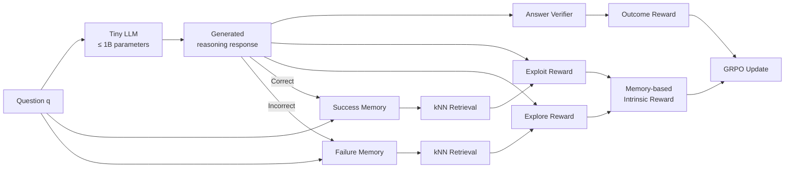

<div align="center">

# 🧠 Memory-R+

### Reasoning Under 1 Billion: Memory-Augmented Reinforcement Learning for Large Language Models

**Hung Le · Van Dai Do · Dung Nguyen · Svetha Venkatesh**

Published in TMLR 2025 · Presented at NeurIPS 2026, Sydney

[](https://openreview.net/forum?id=tmdwuU2uKs)
[](https://neurips.cc/virtual/2026/loc/sydney/poster/156787)
[](https://arxiv.org/abs/2504.02273)
[](https://www.python.org/)
[](LICENSE)


**Memory-augmented reinforcement learning for improving reasoning in tiny language models (≤1B parameters).**

[📄 Paper](https://openreview.net/forum?id=tmdwuU2uKs) ·
[📑 arXiv](https://arxiv.org/abs/2504.02273) ·
[💻 Code](https://github.com/thaihungle/Memory-R)

</div>

---

## 🔥 Overview

Reinforcement-learning-based reasoning methods are highly effective for large language models, but applying them to **tiny LLMs (≤1B parameters)** is substantially more difficult.

Small models often generate few correct trajectories early in training, resulting in:

- sparse correctness rewards,
- poor exploration,
- repeated unsuccessful reasoning patterns, and
- unstable or collapsed RL training.

**Memory-R+** addresses this problem by augmenting RL with **episodic memory**.

The central idea is simple:

> **Remember successful reasoning, avoid repeating failed reasoning, and use both signals to guide exploration.**

Memory-R+ maintains separate memories of successful and failed reasoning trajectories and uses efficient **k-nearest-neighbor retrieval** to produce dense intrinsic rewards during RL training.

---

## 🧠 How Memory-R+ Works



Memory-R+ introduces two complementary intrinsic rewards:

| Component | Memory | Objective |
|---|---|---|
| **Exploit reward** | Successful responses | Encourage reasoning similar to previously successful strategies |
| **Explore reward** | Failed responses | Encourage novel reasoning that avoids repeating previous failures |

The final intrinsic reward combines both signals:

```text
Memory-R+ = Exploitation + Exploration
```

We also evaluate **Memory-R**, an ablated version using only the exploitation component.

---

## ✨ Key Features

- 🧠 **Episodic reasoning memory** for RL fine-tuning
- ✅ Learns from previously successful reasoning trajectories
- 🔍 Explicitly encourages exploration away from failed trajectories
- ⚡ Efficient **kNN-based memory retrieval**
- 📉 Provides dense learning signals when correctness rewards are sparse
- 🛡️ Helps reduce training-collapse behaviour in tiny LLMs
- 💻 Designed for resource-constrained RL fine-tuning
- 🤏 Demonstrated on models as small as **Qwen2.5-0.5B**

---

## 📊 Results

We evaluate three tiny instruction-tuned LLMs:

- **Qwen2.5-0.5B-Instruct**
- **Llama-3.2-1B-Instruct**
- **Falcon3-1B-Instruct**

Models are trained on mathematical reasoning tasks and evaluated using **LightEval extractive match**.

### GSM8K Training

Best-checkpoint GSM8K accuracy (%):

| Model | Base | R1 | Cosine | Memory-R | **Memory-R+** |
|---|---:|---:|---:|---:|---:|
| Qwen2.5-0.5B | 27.8 | 28.8 | 31.2 | **36.0** | 34.0 |
| Falcon3-1B | 32.9 | 16.3 | **37.4** | 36.3 | 34.8 |
| Llama3.2-1B | 26.3 | 37.2 | 38.1 | 39.9 | **40.7** |

For example, on **Llama3.2-1B**, Memory-R+ improves GSM8K accuracy from **37.2% with standard R1-style RL to 40.7%**.

For the much smaller **Qwen2.5-0.5B**, Memory-R achieves **36.0% GSM8K accuracy**, compared with **28.8% for R1**. Memory-R+ also improves cross-dataset MATH-500 performance to **24.4%**, compared with **18.9% for R1**.

> See the paper for complete results on **GSM8K, MATH-500, AIME24**, AI-MO training, ablations, and training-collapse analyses.

---

## 🚀 Installation

### 1. Clone the repository

```bash
git clone https://github.com/thaihungle/Memory-R.git
cd Memory-R
```

### 2. Create the environment

```bash
conda create -n memoryr python=3.11
conda activate memoryr
```

### 3. Install dependencies

```bash
pip install -r requirements.txt
```

---

## 🧪 Experiments

The commands below reproduce the **GSM8K training experiments**.

### Methods

The `--use_ir` argument selects the reward configuration:

| Argument | Method | Description |
|---|---|---|
| `r1` | R1 | Standard GRPO-style RL |
| `cosine` | Cosine | RL with response-length-based cosine reward |
| `memoryr` | Memory-R | Memory-based exploitation reward |
| `memoryr+` | **Memory-R+** | Exploitation + exploration rewards |

For the memory variants, `--k` controls the number of nearest neighbors retrieved from episodic memory.

---

### 🔹 Qwen2.5-0.5B-Instruct

<details open>
<summary><b>Show training commands</b></summary>

```bash
# R1 baseline
python run_gsm8k.py \
    --model_name=Qwen/Qwen2.5-0.5B-Instruct \
    --use_ir=r1 \
    --num_shots=0 \
    --nepochs=1 \
    --seed=0 \
    --bs=2 \
    --gc=8 \
    --L=200

# Cosine reward
python run_gsm8k.py \
    --model_name=Qwen/Qwen2.5-0.5B-Instruct \
    --use_ir=cosine \
    --num_shots=0 \
    --nepochs=1 \
    --seed=0 \
    --bs=2 \
    --gc=8 \
    --L=200

# Memory-R: exploitation only
python run_gsm8k.py \
    --model_name=Qwen/Qwen2.5-0.5B-Instruct \
    --use_ir=memoryr \
    --k=1 \
    --num_shots=0 \
    --nepochs=1 \
    --seed=0 \
    --bs=2 \
    --gc=8 \
    --L=200

# Memory-R+: exploitation + exploration
python run_gsm8k.py \
    --model_name=Qwen/Qwen2.5-0.5B-Instruct \
    --use_ir=memoryr+ \
    --k=1 \
    --num_shots=0 \
    --nepochs=1 \
    --seed=0 \
    --bs=2 \
    --gc=8 \
    --L=200
```

</details>

---

### 🔹 Llama-3.2-1B-Instruct

> **Note:** Llama-3.2-1B-Instruct requires `num_shots=1` in our setup. Without an in-context example, the base model rarely generates valid correct answers, leaving insufficient correctness reward for RL learning.

<details>
<summary><b>Show training commands</b></summary>

```bash
# R1 baseline
python run_gsm8k.py \
    --model_name=meta-llama/Llama-3.2-1B-Instruct \
    --use_ir=r1 \
    --num_shots=1 \
    --nepochs=1 \
    --seed=0 \
    --bs=2 \
    --gc=8 \
    --L=200

# Cosine reward
python run_gsm8k.py \
    --model_name=meta-llama/Llama-3.2-1B-Instruct \
    --use_ir=cosine \
    --num_shots=1 \
    --nepochs=1 \
    --seed=0 \
    --bs=2 \
    --gc=8 \
    --L=200

# Memory-R
python run_gsm8k.py \
    --model_name=meta-llama/Llama-3.2-1B-Instruct \
    --use_ir=memoryr \
    --k=1 \
    --num_shots=1 \
    --nepochs=1 \
    --seed=0 \
    --bs=2 \
    --gc=8 \
    --L=200

# Memory-R+
python run_gsm8k.py \
    --model_name=meta-llama/Llama-3.2-1B-Instruct \
    --use_ir=memoryr+ \
    --k=1 \
    --num_shots=1 \
    --nepochs=1 \
    --seed=0 \
    --bs=2 \
    --gc=8 \
    --L=200
```

</details>

---

### 🔹 Falcon3-1B-Instruct

<details>
<summary><b>Show training commands</b></summary>

```bash
# R1 baseline
python run_gsm8k.py \
    --model_name=tiiuae/Falcon3-1B-Instruct \
    --use_ir=r1 \
    --num_shots=0 \
    --nepochs=1 \
    --seed=0 \
    --bs=1 \
    --gc=16 \
    --L=200

# Cosine reward
python run_gsm8k.py \
    --model_name=tiiuae/Falcon3-1B-Instruct \
    --use_ir=cosine \
    --num_shots=0 \
    --nepochs=1 \
    --seed=0 \
    --bs=1 \
    --gc=16 \
    --L=200

# Memory-R
python run_gsm8k.py \
    --model_name=tiiuae/Falcon3-1B-Instruct \
    --use_ir=memoryr \
    --k=1 \
    --num_shots=0 \
    --nepochs=1 \
    --seed=0 \
    --bs=1 \
    --gc=16 \
    --L=200

# Memory-R+
python run_gsm8k.py \
    --model_name=tiiuae/Falcon3-1B-Instruct \
    --use_ir=memoryr+ \
    --k=1 \
    --num_shots=0 \
    --nepochs=1 \
    --seed=0 \
    --bs=1 \
    --gc=16 \
    --L=200
```

</details>

---

## 📋 Reproduction Settings

| Model | Shots | Batch Size | Gradient Accumulation | Max Length | Memory `k` |
|---|---:|---:|---:|---:|---:|
| Qwen2.5-0.5B-Instruct | 0 | 2 | 8 | 200 | 1 |
| Llama-3.2-1B-Instruct | 1 | 2 | 8 | 200 | 1 |
| Falcon3-1B-Instruct | 0 | 1 | 16 | 200 | 1 |

To reproduce the reported experiments across random initializations, run the experiments with the seeds used in the paper rather than relying on a single seed.

---

## 📏 Evaluation

Evaluation uses **LightEval-style extractive matching**.

```bash
python run_eval.py \
    --task=gsm8k \
    --model_name=path/to/model/
```

Example:

```bash
python run_eval.py \
    --task=gsm8k \
    --model_name=outputs/qwen-memoryr-plus/
```

The paper additionally reports evaluation on:

- GSM8K
- MATH-500
- AIME24

---

## 📁 Repository Structure

```text
Memory-R/
├── evaluation/          # Evaluation utilities
├── rewards/             # Reward implementations
├── run_gsm8k.py         # GSM8K RL training
├── run_eval.py          # Evaluation entry point
├── evaluate.py          # Evaluation utilities
├── utils_gsm8k.py       # GSM8K utilities
├── requirements.txt
├── LICENSE
└── README.md
```

---

## 💡 Memory-R vs. Memory-R+

### Memory-R

Uses the **success memory only**.

Generated reasoning receives a higher intrinsic reward when it is close to reasoning patterns that previously produced correct answers.

```text
Reasoning
    ↓
Success Memory
    ↓
Similarity / Exploitation Reward
    ↓
RL Update
```

### Memory-R+

Uses both **success and failure memories**.

```text
                    ┌── Success Memory ──→ Exploit successful patterns
Reasoning ──────────┤
                    └── Failure Memory ──→ Explore away from failed patterns
                                      ↓
                              Intrinsic Reward
                                      ↓
                                  RL Update
```

This provides an explicit **exploration–exploitation mechanism for language-model reasoning**.

---

## 🔬 Why Episodic Memory?

Standard correctness rewards only answer:

> *Was the final answer correct?*

They provide little information about the quality of an incorrect reasoning trajectory.

Memory-R+ supplements this sparse signal with information from previous experiences:

```text
Past success → "Try reasoning more like this."

Past failure → "Try something different from this."
```

As training progresses, the memory evolves together with the policy, providing a continually updated intrinsic learning signal.

---

## 📚 Code References

This implementation builds upon ideas and infrastructure from:

- [Open-R1](https://github.com/huggingface/open-r1)
- [Minimal GRPO implementation](https://gist.github.com/willccbb/4676755236bb08cab5f4e54a0475d6fb)
- [LightEval](https://github.com/huggingface/lighteval)

We thank the authors and maintainers of these projects for making their work publicly available.

---

## 📝 Citation

If you find this work useful, please cite:

```bibtex
@article{le2025reasoning,
  title   = {Reasoning Under 1 Billion: Memory-Augmented Reinforcement Learning for Large Language Models},
  author  = {Le, Hung and Do, Van Dai and Nguyen, Dung and Venkatesh, Svetha},
  journal = {Transactions on Machine Learning Research},
  year    = {2025},
  url     = {https://openreview.net/forum?id=tmdwuU2uKs}
}
```

---

## 🤝 Acknowledgements

This repository uses the **Open-R1** ecosystem for reinforcement-learning fine-tuning and **LightEval** for evaluation.

The research was conducted at the **Applied Artificial Intelligence Institute, Deakin University, Australia**.

---

<div align="center">

### 🧠 Small models can reason better when they remember.

If you find Memory-R+ useful, consider giving the repository a ⭐.

</div>
